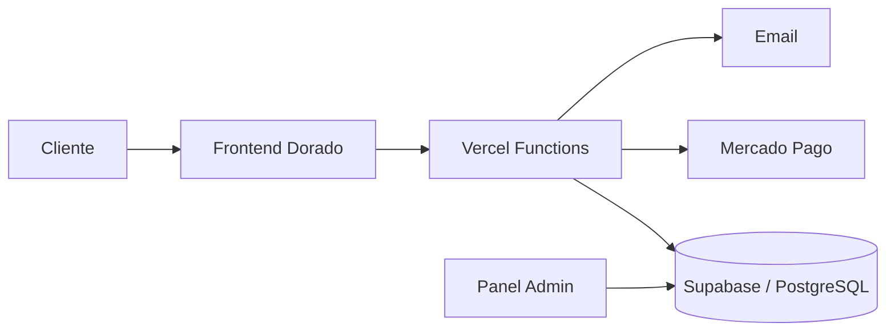

# Dorado Artículos de Pesca

<p align="center">
  
</p>

<p align="center">
  E-commerce full stack para un comercio real de artículos de pesca en San Fernando, Buenos Aires.
</p>

<p align="center">
  <a href="https://dorado-art-pesca.vercel.app"><strong>Ver demo</strong></a>
  ·
  <a href="./docs/ARCHITECTURE.md">Arquitectura</a>
  ·
  <a href="./docs/DEPLOYMENT.md">Deploy</a>
  ·
  <a href="./.github/SECURITY.md">Seguridad</a>
</p>


## Sobre el proyecto

Dorado Artículos de Pesca es una tienda online responsive desarrollada para centralizar catálogo, compra, atención y gestión operativa de un comercio minorista.

El proyecto combina una experiencia de compra adaptada a desktop y mobile con backend serverless, Supabase/PostgreSQL, panel administrativo, control de stock, seguimiento de pedidos y una integración de Mercado Pago preparada para activarse cuando estén disponibles las credenciales comerciales definitivas.

## Funcionalidades principales

- Catálogo dinámico con búsqueda y filtros por categoría.
- Ficha de producto con galería de imágenes.
- Carrito persistente y checkout responsive.
- Métodos de coordinación por WhatsApp, transferencia y efectivo con retiro.
- Integración de Mercado Pago con checkout seguro, ventana de pago de 24 horas y reintentos.
- Seguimiento privado de pedidos mediante token.
- Panel Admin para productos, stock, imágenes, descuentos, cupones y estados de pedidos.
- Dirección, mapa, horarios y estado abierto/cerrado.
- Navegación móvil propia y experiencia desktop diferenciada.
- SEO básico, sitemap, robots, PWA y página 404.
- Emails automáticos para pago pendiente, aprobado y cancelado/rechazado.
- Descuentos por producto y cupones validados server-side.
- Validación server-side, RLS, rate limiting y manejo de secretos fuera del frontend.

## Stack

| Capa | Tecnología |
|---|---|
| Frontend | HTML5, CSS3, JavaScript ES Modules |
| Backend | Vercel Serverless Functions / Node.js |
| Base de datos | Supabase + PostgreSQL |
| Seguridad | Row Level Security, service role server-side, rate limiting |
| Pagos | Mercado Pago Checkout Pro |
| Email | Nodemailer / Gmail App Password (`doradoartpesca@gmail.com`) |
| Deploy | Vercel |
| Control de versiones | Git + GitHub |

## Arquitectura



Más detalle en [docs/ARCHITECTURE.md](./docs/ARCHITECTURE.md).

## Estructura del repositorio

```text
.
├── api/                 # Endpoints serverless
├── assets/
│   ├── css/             # Estilos storefront, checkout y admin
│   ├── images/          # Marca y fondos optimizados
│   └── js/              # Lógica de tienda, admin y seguimiento
├── database/            # Setup, upgrades y hardening de Supabase
├── docs/                # Documentación técnica y operativa
├── lib/                 # Utilidades server-side
├── scripts/             # Comprobaciones automáticas del proyecto
├── admin.html
├── index.html
├── pedido.html
└── politicas.html
```

## Estado

**Preproducción.** La aplicación y la infraestructura técnica están preparadas. Antes de habilitar ventas completas faltan decisiones y datos comerciales que dependen del negocio:

- email comercial definitivo y usuario Admin;
- credenciales productivas de Mercado Pago;
- condiciones, costos y transportistas de envío;
- carga del catálogo real con precios y stock;
- compra real de validación end-to-end.

Ver [docs/PRE_PRODUCTION_CHECKLIST.md](./docs/PRE_PRODUCTION_CHECKLIST.md).

## Desarrollo local

Requisitos: Node.js 20 o superior.

```bash
git clone https://github.com/angeljoaquinbogado/Dorado-Art-Pesca.git
cd Dorado-Art-Pesca
npm install
npm run check
```

Las variables requeridas están documentadas en [.env.example](./.env.example). No deben subirse secretos reales al repositorio.

## Calidad

El repositorio incluye una comprobación automática que valida:

- sintaxis JavaScript;
- JSON del proyecto;
- referencias locales principales en HTML;
- balance básico de CSS;
- archivos requeridos;
- ausencia de archivos `.env` reales.

Ejecutar localmente:

```bash
npm run check
```

El mismo control se ejecuta en GitHub Actions para pushes y pull requests contra `main`.

## Documentación

- [Arquitectura](./docs/ARCHITECTURE.md)
- [Deploy y variables](./docs/DEPLOYMENT.md)
- [Configuración comercial](./docs/BUSINESS_CONFIGURATION.md)
- [Checklist de preproducción](./docs/PRE_PRODUCTION_CHECKLIST.md)
- [Base de datos](./database/README.md)
- [Seguridad](./.github/SECURITY.md)
- [Historial de cambios](./CHANGELOG.md)
- [Índice de documentación](./docs/README.md)

## Autor

**Joaquín Bogado**

Proyecto desarrollado como solución e-commerce para Dorado Artículos de Pesca.

---

> Las credenciales, tokens y secretos de producción se gestionan exclusivamente mediante variables de entorno y no forman parte de este repositorio.
