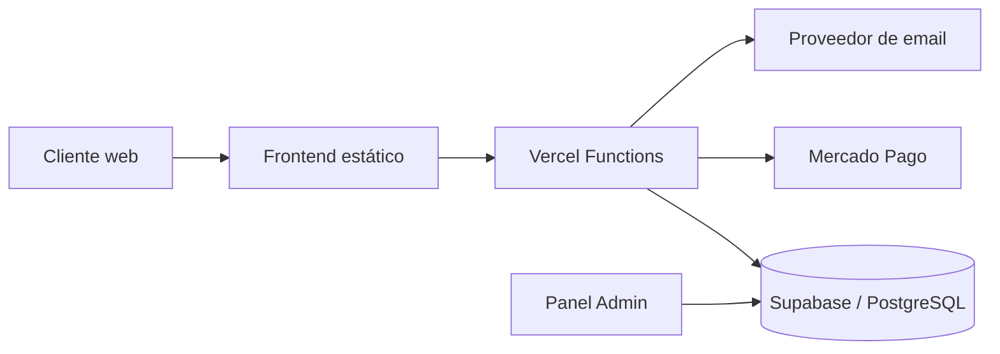

# Arquitectura

## Vista general

Dorado Artículos de Pesca utiliza una arquitectura web simple orientada a serverless:

## Frontend

Los documentos principales son:

- `index.html`: storefront, catálogo, carrito y checkout.
- `admin.html`: panel administrativo.
- `pedido.html`: seguimiento de pedidos.
- `politicas.html`: condiciones comerciales y privacidad.
- `assets/js/site.js`: comportamiento de la tienda.
- `assets/js/admin.js`: operaciones del panel.
- `assets/js/pedido.js`: seguimiento.
- `assets/css/`: estilos separados por contexto y dispositivo.

## Backend serverless

Los endpoints dentro de `api/` se ejecutan como funciones de Vercel.

Responsabilidades principales:

- `products.js`: catálogo público.
- `checkout.js`: validación server-side y creación del flujo de compra.
- `mercadopago-webhook.js`: recepción de notificaciones de pago.
- `order-status.js`: consulta privada de estado.
- `address-search.js`: soporte para búsqueda de dirección.
- `admin-delete-orders.js`: acción administrativa protegida.
- `public-config.js`: configuración pública controlada.

## Datos

Supabase/PostgreSQL administra:

- productos;
- stock;
- pedidos;
- ítems de pedido;
- administradores;
- funciones de seguridad y rate limiting.

Row Level Security restringe las operaciones directas desde el navegador. Las operaciones que requieren privilegios usan credenciales de servidor.

## Pagos

La integración de Mercado Pago está implementada pero permanece deshabilitada mientras `MERCADOPAGO_ENABLED=false`.

La aplicación no debe confiar en precios o stock enviados por el cliente: el backend valida la información contra la base antes de crear operaciones sensibles.

## Seguimiento

Los pedidos disponen de un token de seguimiento independiente del ID interno. El frontend de seguimiento consulta el endpoint correspondiente sin exponer acceso general a la tabla de pedidos.

## Email

`lib/order-email.js` centraliza el envío de confirmaciones. La base incluye control de estado e intentos para evitar reenvíos duplicados en procesos repetidos.

## Seguridad

Ver [../SECURITY.md](../SECURITY.md) y los scripts de `database/`.
